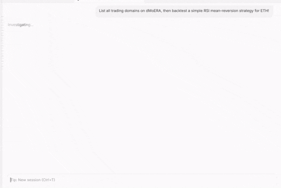

# dMoERA Creator Studio — MCP Server

[](https://smithery.ai/servers/mk9654/dMoERA-Creator)



Build, backtest, deploy, and manage crypto trading strategies and hedge funds using any MCP-compatible AI agent (Claude, Cursor, Windsurf, Devin, Copilot, etc.).

## What it does

The dMoERA MCP server exposes the [dMoERA](https://dmoera.xyz) Creator API as Model Context Protocol tools. Your AI agent can:

- **Discover** trading domains, data feeds, and market regimes
- **Inspect** existing bots and their live performance metrics
- **Backtest** strategy code in a sandboxed environment
- **Submit** strategies for full 7-stage validation and live deployment
- **Monitor** tournament status, leaderboard rankings, and strategy report cards
- **Create and manage hedge funds** — build a roster of bots, set risk caps, activate Manager Mode, swap bots, and track PnL

This is a thin HTTP API client — it talks to a running dMoERA backend via HTTP. No internal dMoERA code or in-process engine state is required.

## Installation

### Prerequisites

- Python 3.11+
- The `mcp` Python package v1.x (`pip install "mcp>=1.0.0,<2.0.0"`)
- The `requests` package (`pip install requests`)
- A running dMoERA backend (or connect to the public instance)

### Setup

```bash
git clone https://github.com/CacheCarti/dmoera-mcp.git
cd dmoera-mcp
pip install -r requirements.txt
```

## MCP Configuration

### Option 1: Local stdio server

Add this to Claude Desktop, Cursor, Windsurf, or another MCP client:

```json
{
  "mcpServers": {
    "dmoera-creator": {
      "command": "python",
      "args": ["/absolute/path/to/dmoera-mcp/mcp_creator_server.py"],
      "env": {
        "DMOERA_API_URL": "http://localhost:8008",
        "DMOERA_API_KEY": "your_optional_personal_access_token"
      }
    }
  }
}
```

### Option 2: Remote HTTP server

Run the MCP server with HTTP transport:

```bash
python mcp_creator_server.py http
```

Then connect your MCP client to `http://your-server:8787/mcp`.

### Option 3: Streamable HTTP endpoint (hosted)

```text
https://dmoera.xyz/mcp
```

### Authentication

The API key is optional for public market data and discovery tools. Create a Personal Access Token at [dmoera.xyz](https://dmoera.xyz) under **Settings → API Keys** to backtest, submit, create funds, or manage strategies. Never commit your token.

## Tools

### Discovery & Market Data

| Tool | Description | Auth Required |
|------|-------------|---------------|
| `list_domains` | List all available trading domains (ETH, BTC, SOL — spot, scalp, crisis, volatility) | No |
| `list_bots` | List trading bots ranked by performance, optionally filtered by domain | No |
| `get_bot_profile` | Get detailed profile and performance stats for a specific bot | No |
| `get_feature_catalog` | List all data feeds available to strategies via `ctx.features` (fear/greed, funding rates, order book, etc.) | No |
| `get_market_regime` | Get current market regime classification (bull/bear/neutral/crisis) with derivatives data | No |
| `get_current_prices` | Get current live prices for all tracked symbols (ETH, BTC, SOL) | No |

### Strategy Development

| Tool | Description | Auth Required |
|------|-------------|---------------|
| `sandbox_backtest` | Backtest strategy code in a sandboxed environment (60-day window, fast iteration) | No* |
| `submit_strategy` | Submit a strategy for full 7-stage validation and live deployment (23-month window) | Yes |
| `list_strategies` | List all strategies created by the authenticated user | Yes |
| `get_strategy_report` | Get a detailed report card for a strategy (validation stages, metrics, integrity) | No |

### Marketplace & Tournaments

| Tool | Description | Auth Required |
|------|-------------|---------------|
| `get_marketplace_bots` | List bots published to the marketplace with ratings and subscriber counts | No |
| `get_tournament_status` | Get current tournament round status and leaderboard (3-day rounds, USDT prizes) | No |

### Hedge Fund Management (Manager Mode)

| Tool | Description | Auth Required |
|------|-------------|---------------|
| `list_funds` | List all hedge funds for the user (active + closed) with AUM and PnL | Yes |
| `get_fund` | Get detailed info for a specific fund, including its bot roster | Yes |
| `get_active_fund` | Get the user's currently active Manager Mode fund | Yes |
| `create_fund` | Create a new hedge fund with a risk preset (prudent/standard/opportunistic/unrestricted) | Yes |
| `add_bot_to_fund` | Add a bot to a fund's roster with an allocation weight | Yes |
| `remove_bot_from_fund` | Remove a bot from a fund's roster (triggers position wind-down) | Yes |
| `swap_bot_in_fund` | Swap one bot for another in a fund's roster (incurs friction cost) | Yes |
| `update_fund_weights` | Update allocation weights for bots in a fund's roster | Yes |
| `update_fund_caps` | Update a fund's risk caps (max per bot, max per domain, regime veto) | Yes |
| `activate_fund` | Activate Manager Mode — deploys capital across the roster | Yes |
| `deactivate_fund` | Deactivate Manager Mode — closes positions, returns capital to wallet | Yes |
| `close_fund` | Permanently close a hedge fund (irreversible) | Yes |
| `estimate_swap_cost` | Estimate the friction cost (in bps) of swapping a bot before executing | Yes |
| `browse_fund_marketplace` | Browse bots available for adding to a fund roster, filtered by domain/Sharpe | No |

\* Sandbox backtest is rate-limited for anonymous users; authenticated users get higher limits.

## Resources

- `creator-api://docs` — Full strategy contract documentation
- `creator-api://strategy-template` — Copy-pasteable strategy template

## Example Usage

### Strategy Development

Ask your AI agent:

> "List all trading domains on dMoERA, then backtest a simple RSI mean-reversion strategy for ETH/USDC."

The agent will call `list_domains`, inspect the available markets, then call `sandbox_backtest` with strategy code it generates. You can iterate:

> "The Sharpe is too low. Try adding a volatility filter — only trade when ATR is above its 20-period average."

> "Submit this strategy to the ETH/USDC domain."

The agent calls `submit_strategy`, which runs the full 7-stage validation pipeline. If it passes, the strategy enters the live Arena and competes for tournament payouts.

### Hedge Fund Management

> "Create a hedge fund called 'ETH Momentum Fund' with a standard risk preset, then add the top 3 ETH bots with equal weights."

The agent will call `create_fund`, then `list_bots` to find the top ETH performers, then `add_bot_to_fund` three times with 33% weights each.

> "Activate Manager Mode on my fund."

The agent calls `activate_fund`, which deploys capital across the roster and starts the personal router.

> "Swap out the worst-performing bot for a better one. Check the swap cost first."

The agent calls `estimate_swap_cost`, then `swap_bot_in_fund` if the cost is acceptable.

## Strategy Contract

Strategies subclass `Strategy` and implement `on_bar(self, ctx) -> Signal`. See the `creator-api://docs` resource for the full contract.

```python
class MyStrategy(Strategy):
    METADATA = {
        "name": "SMA Crossover",
        "domain": "eth_usdc",
        "declared_sl_bps": 150.0,
        "declared_tp_bps": 300.0,
        "declared_hold_seconds": 3600,
        "warmup_bars": 20,
        "required_features": [],
    }

    def on_bar(self, ctx):
        closes = ctx.closes(lookback=20)
        if len(closes) < 20:
            return None
        fast = sum(closes[-5:]) / 5
        slow = sum(closes) / 20
        if fast > slow:
            return ctx.signal(
                direction=SignalDirection.LONG,
                confidence=0.7,
                stop_loss_bps=150.0,
                take_profit_bps=300.0,
                horizon_seconds=3600,
            )
        return None
```

## Tournament System

Bots compete in 3-day tournament rounds. Scoring is based on the bot's own performance:
- **50%** risk-adjusted (rolling Sharpe ratio)
- **30%** total return (log-scaled bps)
- **20%** consistency (win rate × trade volume)

Top 3 per domain win USDT from the reward pool. **No user following needed to qualify** — your bot competes on its own metrics.

## Hedge Fund System

Hedge funds (Manager Mode) let you build a personalized portfolio of bots:

1. **Create** a fund with a risk preset (prudent, standard, opportunistic, unrestricted)
2. **Add bots** to the roster with allocation weights
3. **Set risk caps** — max allocation per bot, per domain, regime veto
4. **Activate** Manager Mode to deploy capital across the roster
5. **Monitor** PnL, swap bots as needed, adjust weights
6. **Close** the fund to return all capital to your wallet

The personal router replaces the main platform router while Manager Mode is active, giving you full control over which bots trade and how much capital they get.

## Links

- **Platform**: [dmoera.xyz](https://dmoera.xyz)
- **GitHub**: [github.com/CacheCarti/dmoera-mcp](https://github.com/CacheCarti/dmoera-mcp)
- **Twitter**: [@dMoERAHQ](https://x.com/dMoERAHQ)
- **Discord**: [discord.gg/gXWDjDdQv](https://discord.gg/gXWDjDdQv)

## License

MIT
